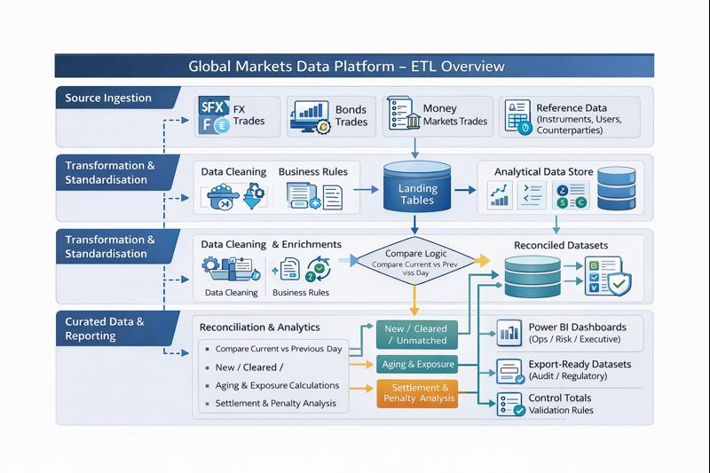

# 🏦 RMB Global Markets Data Platform

## 📌 Overview
This repository demonstrates an enterprise-scale data engineering and analytics solution supporting **Global Markets operations** in a Tier-1 banking environment.

The solution enables **T+0 operational reporting**, **automated reconciliations**, **settlement monitoring**, and **penalty risk analysis**, while aligning to strict governance and audit standards.

---
## 💡 Why This Matters
Global Markets operations require accurate same-day (T+0) visibility to manage
settlement risk, capital exposure, and regulatory compliance.

This platform demonstrates how enterprise data engineering can:
- Replace manual reconciliations with automated controls
- Detect settlement failures early to reduce penalties
- Provide trusted, auditable data to Operations, Risk, and Finance teams
  
---
## 🧩 Business Context
Global Markets operations span multiple asset classes including:
- Foreign Exchange (FX)
- Bonds
- Money Markets

Data originates from multiple transactional systems with varying structures and data quality challenges. Manual reconciliation processes historically introduced operational risk and reporting delays.

---

## 🎯 Objectives
- Build scalable ETL pipelines for Global Markets data
- Automate reconciliation and settlement logic
- Enable same-day operational visibility
- Improve audit readiness through data quality controls
- Deliver executive and operational reporting

---
## 📈 Key Metrics & KPIs
The platform enables tracking of critical Global Markets operational metrics:

- T+0 Reconciliation Rate
- Unmatched Trade Count & Exposure Value
- Aging Buckets (T+1, T+2, T+3+)
- Late Settlement Rate
- Estimated Penalty Exposure
- Daily Operational Breaks by Asset Class

---
## 🛠️ Technology Stack
- SQL (Enterprise data platform)
- Python & SQL-based transformations
- Power BI for reporting and analytics
- Governance-aligned data engineering practices
----
## 📂 Artifacts

---
## 📁 Documentation & Governance
Supporting documents including business context, KPI definitions, design decisions, and audit considerations.  
➡️ [View Documentation & Governance](docs/documentation_and_governance.)

---
## 🔄 Solution Architecture
The solution follows a layered architecture:
1. Source ingestion (FX, Bonds)
2. Standardisation and transformation
3. Reconciliation and settlement analytics
4. Curated datasets for reporting and regulatory use

---
## 🔁 Reconciliation Logic (Conceptual)
Reconciliations are performed using a snapshot-based comparison framework:

- Compare current-day positions vs previous-day snapshots
- Classify records as:
  - **New** – Appears today, not previously
  - **Cleared** – Previously present, now resolved
  - **Unmatched** – Present in both but with key discrepancies
- Apply aging based on trade date vs reporting date

---
## 🧠 Key Components
### ETL Pipelines
- Multi-source ingestion
- Business rule standardisation
- Data validation and quality checks

### Reconciliation & Settlements
- Current vs previous day comparison
- New, Cleared, and Unmatched classification
- Aging and exposure tracking

### Penalty Risk Monitoring
- Identification of late settlements
- Exposure and trend analysis

### Data Governance
- Control totals and validation rules
- Audit-friendly datasets
- Reusable reconciliation framework

---

## 📊 Reporting

Power BI dashboards provide role-based reporting for Global Markets:

- Daily operational KPIs
- Unmatched and aging trends
- Settlement and penalty visibility
- Executive summaries

📁 Sample dashboard wireframes are included:
➡️ [View Power BI Dashboard Mockups](powerbi/dashboard_wireframes)

---

## 🚀 Business Outcomes
- Reduced manual reconciliation effort
- Improved same-day operational decision-making
- Enhanced transparency and audit readiness
- Scalable framework reusable across asset classes

---

## 🔐 Data Privacy
All datasets in this repository are **simulated and anonymised**.  
No proprietary, client, or bank-sensitive data is exposed.

---
## 🔮 Future Enhancements
- Near-real-time ingestion and monitoring
- Automated anomaly detection on reconciliation breaks
- SLA breach alerts for settlement failures
- Workflow integration for break resolution
  
---
🔙 Return to main portfolio: [Andiswa-Matai_Portfolio](https://github.com/AndiswaMatai/Andiswa-Matai_Portfolio)

